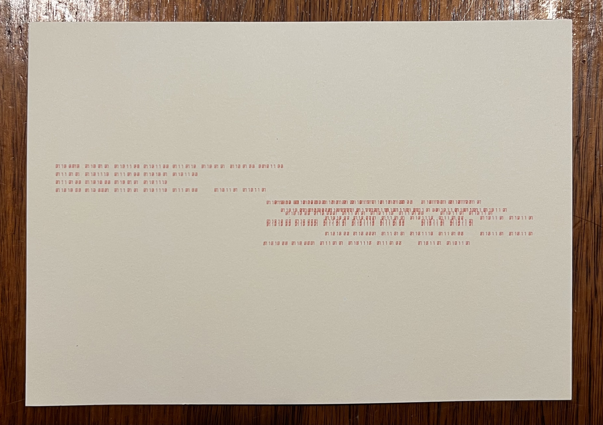

# machineYearning


machineYearning is an artwork consisting of five words represented in binary that depicts a crazy lover’s visceral yearning for the beloved.machineYearning was created using Python, plotted with AxiDraw.


This project began as a reflection on my personal journey, which then sparked a desire to immortalize a deeply cherished memory of a past.



> Machine Yearning (2023)
> 
> 
> pen on paper
> 
> 5.8 x 8.3 in
>


The text reads:
```
beloved,

until then

haunt me

                            haunt  me (x10)
```

It is a snippet of a poem I wrote -- a tale about separation. Wherein, the mad lover in this story, begs for the beloved to haunt the lover until *then* comes around.

To elucidate the sense of madness, the binary strings on the right side are ten randomised loops of the phrase “haunt me”. This part depicts the lover descend to madness, where the Lover is possessed by the ever-consuming force of yearning for the beloved.

This line was inspired by a line from Emily Brontë’s *Wuthering Heights*:

> “You said I killed you, Haunt me, then”
